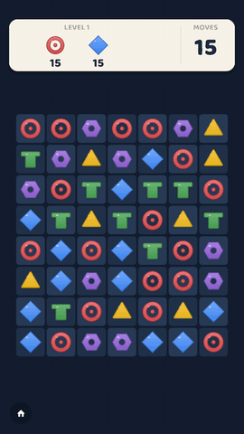
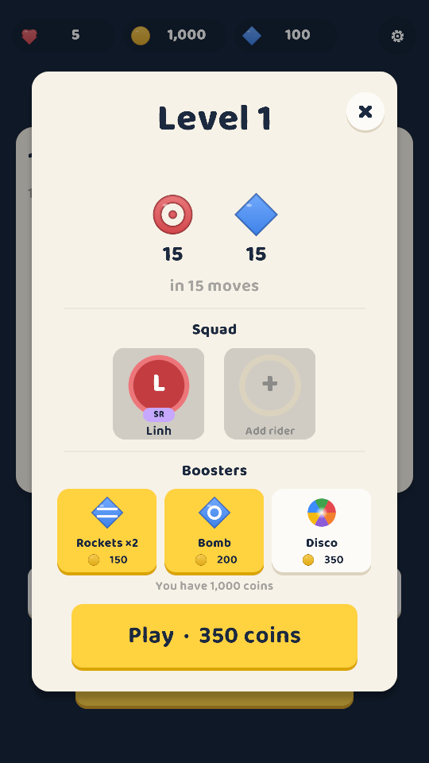
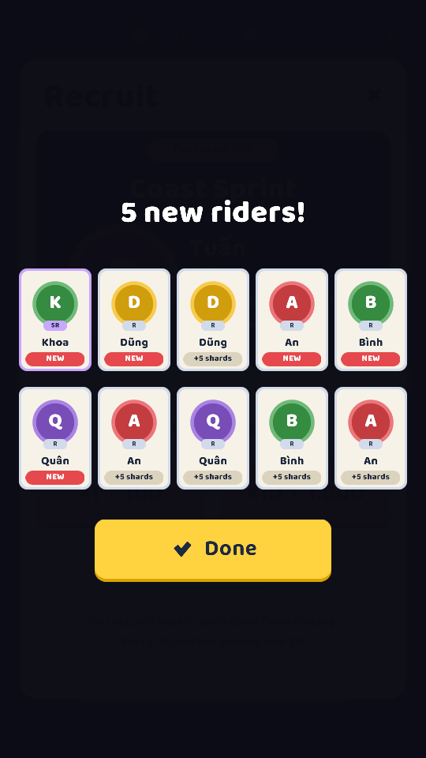
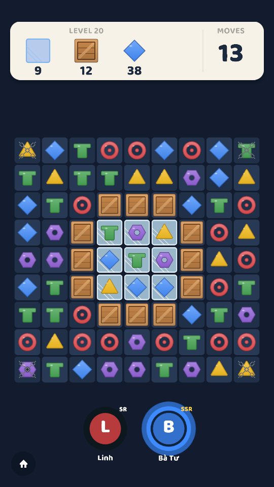
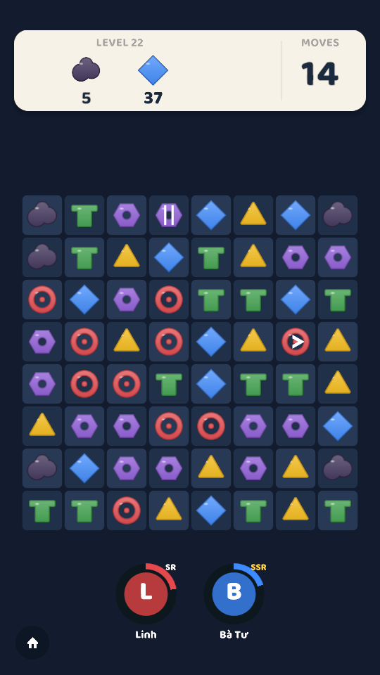
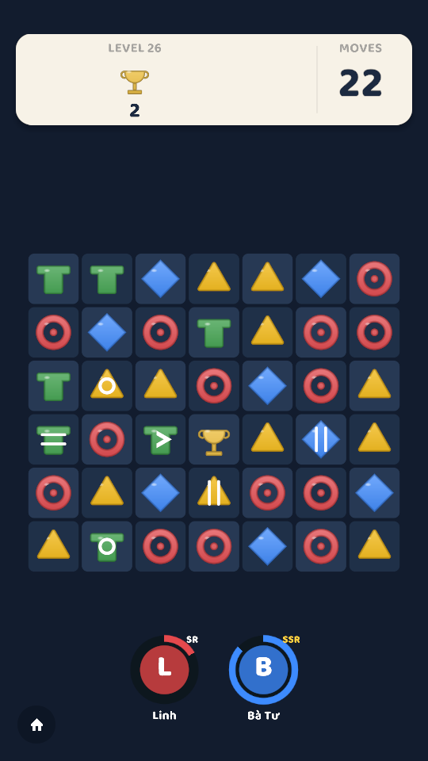
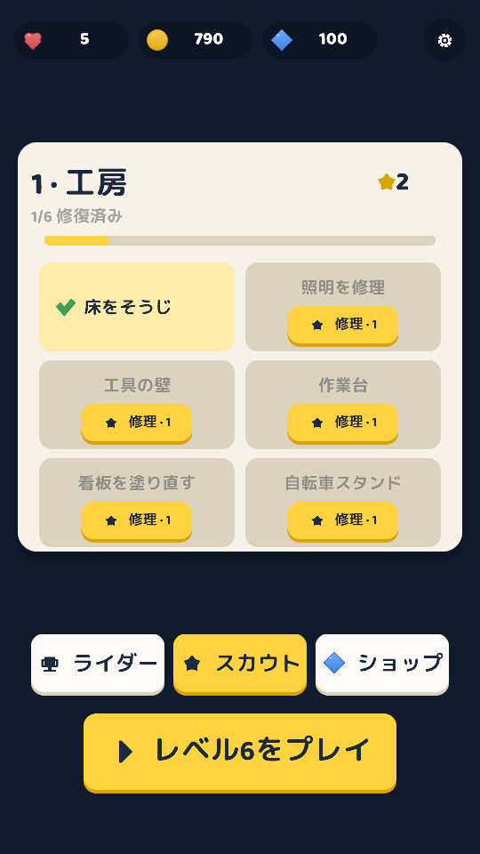
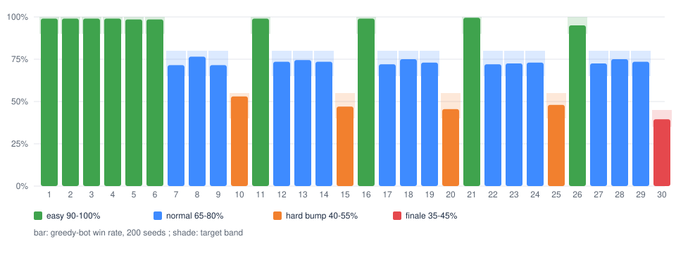

# Cadence Club

*A Royal Match-style match-3 where your cycling club fights to survive.* The old Cadence Club workshop is about to
become a car park. Win levels for stars, spend them restoring the club room by room, and recruit riders whose
powers are your boosters: a sprinter fires rockets along a row, a mechanic breaks crates and ice.

> **Status (Oct 2026):** feature-complete for v1.0.0: 30 levels, 12 riders, gacha, renovation, daily gift,
> demo shop, English / Vietnamese / Japanese. 134 EditMode tests and a PlayMode smoke test pass in Unity 6.3 LTS;
> the smoke test plays the real game from a fresh save, and the screenshots below come from it. There is no
> public build yet: tagging `v1.0.0` builds the Android APK and Windows zip into
> [Releases](https://github.com/tranvantruongdev/cadence-club/releases).

<p>
  
  
  
</p>

*The GIF and screenshots are recorded by PlayMode tests (`TrailerCapture`, `SmokeTests`). The 33-second
[trailer](docs/cadence-club-trailer.mp4) comes from the same capture (`Tools/make-trailer.ps1`).*

| | |
|---|---|
| **Inspired by** | Royal Match (swap-to-match, specials, a home to restore between levels) |
| **Twist** | Riders as boosters: matching a rider's colour charges their power; tap the full portrait to fire it |
| **My role** | Solo: design, code, levels, tuning. Art is drawn in code; icons are Kenney's |
| **Engine** | Unity 6.3 LTS (URP 2D), C#. Built from [unity-mobile-template](https://github.com/tranvantruongdev/unity-mobile-template) |

## How it plays

- **Swap** two neighbouring pieces to line up 3 or more of a colour. 4 in a line makes a **rocket**, an L or T a
  **bomb**, a 2×2 a **glider**, 5 in a line a **disco**. Two specials swapped together combine.
- **Obstacles:** crates (1–2 hits), ice under pieces, chains that lock a piece, **oil** that spreads one cell after
  every move that clears none, and **trophies** that must be brought down to the bottom row.
- **Riders:** up to two in the squad. Clearing their colour fills their charge; a full rider's power uses no move.
- **Between levels:** stars restore the club (5 areas × 6 tasks, each area ends with a story beat), gems recruit
  riders, coins buy boosters and "+5 moves" when you run out. Lives refill over time.
- **First session:** a new player boots straight into level 1 with a fingertip showing the swap; levels 2 and 3
  open on a rocket and a bomb; Home appears after level 3, pointing at the first task to restore.

<p>
  
  
  
  
</p>

## How it's built

```
Assets/_Game/Scripts/Core/      the game in pure C# (no UnityEngine): Board, MatchFinder, MoveResolver, Gravity,
                                LevelState, riders and powers, Bot + LevelSimulator, ClubSave, gacha, MasterData
Assets/_Game/Scripts/Runtime/   Unity side: LevelController, BoardView (replays board events), Home, Recruit,
                                procedural piece art, localization (Loc)
Assets/_Game/Resources/         30 level files (JSON) and master data (CSV: riders, banner, rates, areas, strings…)
Assets/_Game/Editor/            level editor with a built-in bot simulator; UI asset builder (fonts, theme)
Assets/_Game/Tests/             EditMode tests (also run with dotnet), PlayMode smoke test and trailer capture
Assets/_Project/                shared template: boot flow, saves, audio, haptics, UI stack, game feel
```

- **A board model that emits events.** A move is resolved entirely in Core and returns a list of events
  (swapped, cleared, special created, fell, spawned, crate hit, oil spread…). `BoardView` replays them step by
  step, then checks that it matches the Core board; the smoke test fails if it ever has to resync.
- **Levels tuned by a bot.** A greedy bot plays every level 200 times; each level's move limit puts its win rate in
  a target band (easy 90–100%, normal 65–80%, hard bump 40–55%, finale 35–45%). CI runs the check on every push:

  

- **Gacha shown honestly.** R/SR/SSR at 80/17/3%, an SSR guaranteed by pull 60 (the counter is on screen), an SR or
  better in every 10-pull, half of SSRs are the featured rider, duplicates become shards that level riders up. The
  rates screen lists every rider's chance. Gems come only from playing; the shop is a demo with no real purchases.
- **Data-driven.** Riders, banner, rates, renovation, boosters, daily gifts, shop and all UI text live in CSV,
  validated on load and in tests (a test checks every on-screen string has Vietnamese and Japanese).

More in the [case study](docs/case-study.md).

## Tests

```bash
dotnet test Tools/GameTests/CadenceClub.Core.Tests.csproj   # game core + level and master-data files, ~3 min
dotnet test Tools/CoreTests/Template.Core.Tests.csproj      # template core
```

In Unity (headless, Windows):

```bash
powershell -ExecutionPolicy Bypass -File Tools/run-unity-tests.ps1                                  # EditMode
powershell -ExecutionPolicy Bypass -File Tools/run-unity-tests.ps1 -TestPlatform PlayMode -Graphics # smoke test, screenshots in Logs/screenshots
```

## Credits

- Fonts: [Baloo 2](https://github.com/EkType/Baloo2) and [M PLUS Rounded 1c](https://github.com/google/fonts/tree/main/ofl/mplusrounded1c)
  (SIL Open Font License, see `Assets/_Game/Fonts`). Icons: [Kenney](https://kenney.nl) (CC0).
- Inspired by Royal Match. Original art, characters, levels and the rider-booster twist are mine.

MIT licence (code). See [LICENSE](LICENSE).
